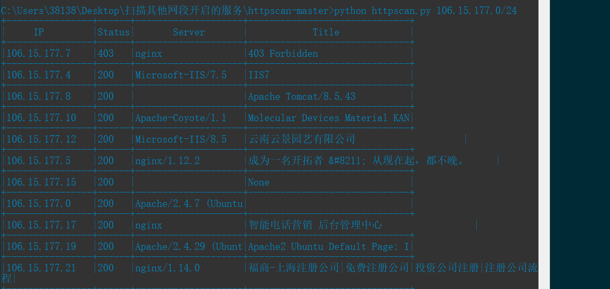
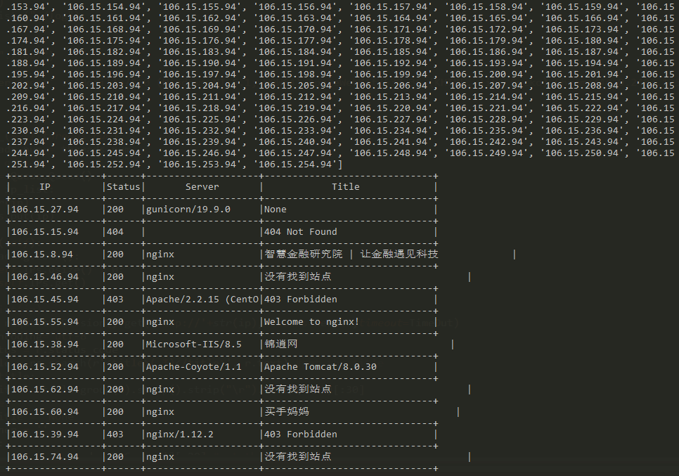

# httpscan3
httpscan的python3版本

httpscan会返回IP http状态码 Web容器版本 以及网站标题。



**Usage**：`./httpscan IP/CIDR –t threads`

Example:`./httpscan.py 10.20.30.0/24 –t 10`


### 支持单扫B段
不过需要改一下自定义
```
per_ip="106.15."
aft_ip=".94"
```

